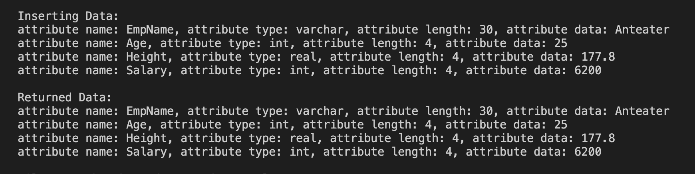

# Fusion DB

A fast, page-based database engine that implements core storage and query building blocks.



## Overview

Fusion DB provides:

- Paged storage with variable-length records  
- Table management (create/drop, insert/update/delete/read)  
- Optional indexes for faster lookups  
- A simple query layer over tables and indexes  

### Architecture

#### Record-Based File Manager (rbf)

- Paged file I/O: create, destroy, open, close files; read/write pages; append pages  
- Record operations: insert, update, delete, read  

#### Relation Manager (rm)

- Table lifecycle: create and drop  
- Tuple operations: insert, delete, update, scan  

#### Index Manager (ix)

- Optional indexing to accelerate selection and joins  
- Integrated by rm and used by qe when present  

#### Query Engine (qe)

- Executes SQL-like queries on top of rm  
- Can leverage ix for optimized plans  

## Requirements

- `make`  
- A C++ compiler (e.g., `g++`)  

## Build and Run

If the build fails, set `CODEROOT` in `makefile.inc` to the root of your codebase:

Edit makefile.inc
CODEROOT=/absolute/path/to/repo/root

### Build and run a component test (example: `rbf`):

```
cd rbf
make clean
make
./rbftest1
```

### Repeat for other components:

```
cd rm && make clean && make && ./rmtest1
cd ix && make clean && make && ./ixtest1
cd qe && make clean && make && ./qetest1
```

## Project Structure
- rbf: Record-based file manager
- rm: Relation (table) manager
- ix: Index manager (optional)
- qe: Query engine
- assets: Images and other assets

## Troubleshooting
- Build path issues:
Verify CODEROOT in makefile.inc points to the repository root.
- Stale artifacts:
Run make clean before make.

## Permissions:
Ensure the process can read/write the working directory (paged files are created on disk).
